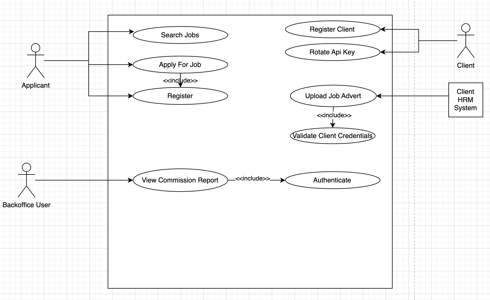
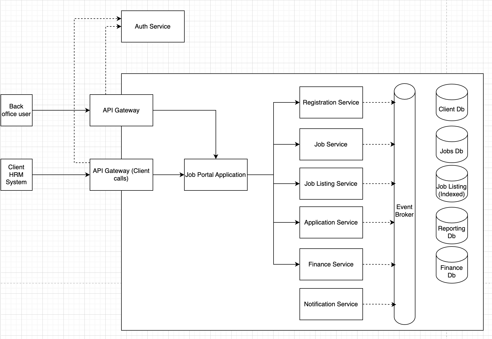
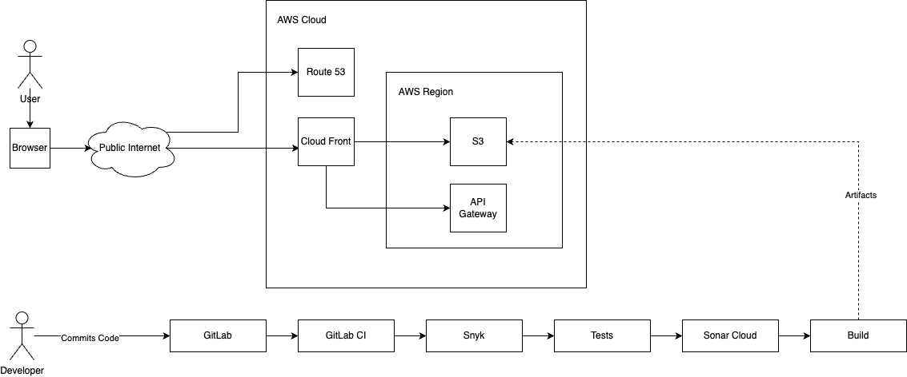

# 1. Project Overview
#### Project Name: Job Portal
#### Author: Pragash Rajarathnam
#### Date: 3rd October 2024
#### Version: 1.0.0

## 1.1 Purpose
This Job Portal allows companies or clients to register and upload job opportunities available in their company. These jobs can then be searched, filtered and viewed by applicants or public users. If the public user wishes they can search a job and apply for that job. Prior to applying for a job each public user has to register with the system. There is a back office module for this application which allows the admin users to view reports such forecast income, etc...

## 1.2 Scope

## 1.3 Stakeholders

# 2. Architecture Overview

This application is going to be designed as a microservice application. We see there are services/modules that need more performant and scaling requirements than other services. Also, there are services that require a different database technology from others. 

## 2.1 Usecase Diagram

## 2.2 Highlevel Architecture Diagram

## 2.3 Microservice Breakdown

### 2.3.1 Identity Service
This is the service that is responsible for registering, authenticating users. This will use oAuth/OIDC for authenticating users. Also, this service will expose a jwk public key url.

This service has the following features,
- Register users
- Login
- Forgot password
- Reset password
- JWK url
Will support integration with other oAuth providers

#### Technologies
AWS Cognito

#### Communication Protocols
HTTPS 2.0 / TLS 1.0

#### Security

### 2.3.2 Client Registration Service
This service is used by clients to register, rotate their API key.

This service allows clients to register with the application. Upon a successful registration an API key is generated and shared with the client. The client has to pass this API key over in their API calls to create job advertisements. The service also allows the user to manage company details such as name, address, contact no, number of employees, roate api keys, etc...

#### Technologies

- Spring Boot
- Kotlin
- Postgresql
- K8S
- Istio
- Docker

#### Communication Protocols

MTLS 

#### Security

### 2.3.3 Job Publication Service

The service which stores the job advertisements for each client. This has end points that can be used by the clients to integrate with their HRM system. Publish job adverts directly from their HRM system with the API key passed in the header.

#### Technologies

- Spring Boot
- Kotlin
- Postgresql
- K8S
- Istio
- Docker
- Kafka

#### Communication Protocols

> MTLS 

### 2.3.4 Application Service

Application service will allow the applicant to apply for a job advert. The applicant can submit his resume and respond job specific questions such as expected salary, contact email, etc...

#### Technologies

- Spring Boot
- Kotlin
- Postgresql
- K8S
- Istio
- Docker
- Kafka

#### Communication Protocols

> MTLS 

### 2.3.5 Forecasting Service

Forecasting service is responsible for listening to events dispatched by other services and storing data for reporting purposes. This service is responsible for calculating the forecast on how much future commission the platform is supposed to earn.

#### Technologies

- Spring Boot
- Kotlin
- Postgresql
- K8S
- Istio
- Docker
- Kafka

#### Communication Protocols

> MTLS 

### 2.3.6 Notification Service

Notification service responsible for dispatching emails, sms, etc... by responding to events from other services.

#### Technologies

- Spring Boot
- Kotlin
- Postgresql
- K8S
- Istio
- Docker
- Kafka

#### Communication Protocols

> MTLS 

# 3. Deployment Overview

This application will be hosted on AWS cloud infrastructure. We will host the backend services in K8S cluster (EKS). Using kafka gives us the needed control, security and scalability. We will Istio service mesh that provides a uniform way to connect, secure, control, and observe microservices.

## 3.1 Deployment Diagram

## 3.2 Infrastructure Components

### 3.2.1 Region
### 3.2.2 VPC
### 3.2.3 EKS
### 3.2.4 Istio
### 3.2.5 API Gateway
### 3.2.6 S3
### 3.2.7 Load Balancers

# 4. Database Management

## 4.1 Service Name
### 4.1.1 Database Type
### 4.1.2 Tables/Collections

# 5. Scalability & Fault Tolerence
## 5.1 Scaling Strategies
### 5.1.1 Horizontal Scaling - Explain how horizontal scaling will be done

## 5.2 Resilience Patterns
### 5.2.1 Circuit Breaker
### 5.2.2 Retry Strategies
### 5.2.3 Timeouts

# 6. Security
## 6.1 Authentication and Authorization
### 6.1.1 Mechanism: (e.g., OAuth 2.0, OpenID Connect). Access Control: How roles and permissions are managed.
## 6.2 Encryption
### 6.2.1 Data Encryption: In-transit and at-rest encryption strategies (e.g., TLS, AES-256).
### 6.2.2 Secrets Management: How secrets (API keys, database credentials) are managed (e.g., HashiCorp Vault, AWS Secrets Manager).

# 7. DevOps and CI/CD
## 7.1 CI/CD Pipeline
### 7.1.1 Tools: List the tools used (e.g., Jenkins, GitLab CI, CircleCI).
### 7.1.2 Automated Tests: Unit tests, integration tests, and deployment pipeline tests.
### 7.1.3 OWASP, Snyk, Sonar Qube

## 7.2 Containerization
### 7.2.1 Containerization Strategy: How services will be containerized (e.g., Docker, Kubernetes).
### 7.2.2 Orchestration: Kubernetes setup, deployment strategies (blue/green, rolling updates).

## 7.3 Monitoring and Logging
### 7.3.1 Monitoring Tools: Tools for monitoring (e.g., Prometheus, Grafana).
### 7.3.2 Logging: Centralized logging system (e.g., ELK stack, Fluentd).
### 7.3.3 Alerts: How alerts will be set up for critical system events (e.g., PagerDuty, OpsGenie).

# 8. Testing Strategy
## 8.1 Unit Tests
> Frameworks: Tools used for unit testing (e.g., JUnit, pytest).
## 8.2 Integration Tests
> Describe how integration tests will validate inter-service communication and API contracts.

## 8.3 End-to-End Testing
> Explain the approach for E2E testing (e.g., Selenium, Cypress) to ensure the system works as a whole.

## 8.4 Performance Testing
> Tools: (e.g., JMeter, Gatling).
> Metrics: Key performance indicators (KPIs) to monitor (e.g., response times, throughput).

# 9. Deployment Strategy
## 9.1 Environments
> Environments: Define the environments (e.g., Dev, QA, Staging, Production) and the deployment process for each.
> Versioning: How services will be versioned and updated in each environment.
## 9.2 Blue/Green and Canary Deployments
> Describe the deployment strategies to minimize downtime (e.g., blue/green deployments, canary releases).

# 10. Non-Functional Requirements
## 10.1 Performance
> Latency: Maximum acceptable latency for service-to-service communication.
Throughput: Expected request load and service response capability.

## 10.2 Reliability
> Define the expected uptime, SLA (Service-Level Agreement), and how high availability will be achieved.

## 10.3 Maintainability
> How the architecture ensures ease of updates and maintenance (e.g., modular design, separation of concerns).

